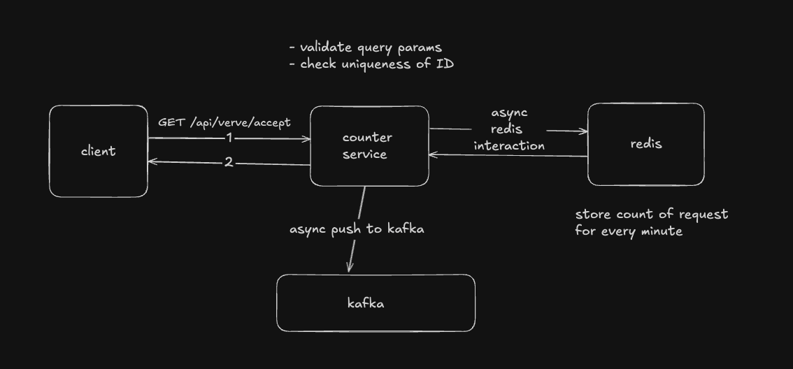

## Design Considerations

- Following `Accept Interface and Return Struct` pattern.
- Using SOLID principles for separation of concerns and making the code modular.

- We are using gin for building the RESTful APIs, redis as the cache and kafka as the message queue(streaming service).
- Using a retry mechanism to ensure connection with kafka at the application layer, since we have observed that at times docker compose takes time to start kafka.
- Handling graceful shutdown to avoid memory leaks and finish ongoing tickers. 

## Data flow Overview

- GET /api/verve/accept
    - Added validation on ID like checking digits and empty string.
    - Accepting url escaped endpoint as query param.
    - Added Redis as a distributed cache for ensuring uniqueness of ID in every minute window.
    - Using redis to store the count of requests in every minute window.
    - Using a Ticker to regularly fetch the count and push on to kafka.
    - Using go routines for handling redis interactions since traffic upto 10k rps is expected. Since redis is single threaded, even if we have multiple requests at the same time with same ID, the second one will get discarded. 

    

    Sample request
    ```shell
    /api/verve/accept?id=43&endpoint=http%3A%2F%2Flocalhost%3A8080%2Fapi%2Fverve%2Faccept
    ```

## Assumptions and TradeOffs

- For the sake of simplicity, we have not added any authentication or authorization layer. This can be added in the future.
- Not using a DB, since from the problem statement writing to log file/pushing onto queue seems to be the objective of the service. A DB can help in keeping timely snapshots of the minute wise count, which can be used for analytical purposes. For this we can implement a write-back cache pattern.
- Using a standalone redis for this example since 10k rps can be served using a redis with decent memory. If required, this can be upgraded to cluster redis at scale.
- If the entire system expects burst traffic, then we can add a queue and push the messages onto the queue and consume them in another worker. Need to take care of timestamps when pushing the messages on the queue to ensure correct entry in redis. 
